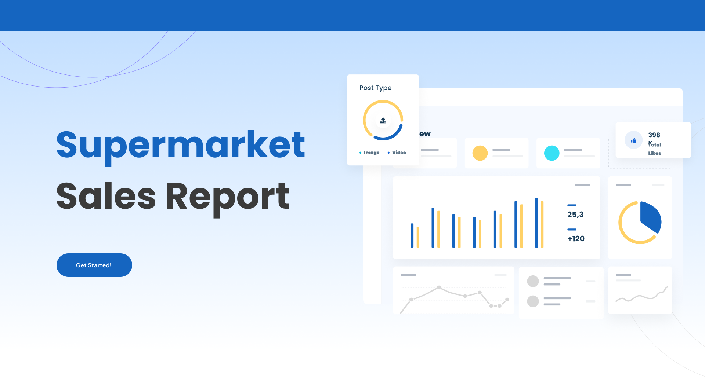

# Looker Studio Dashboard: **Supermarket Sales Report**

Welcome to the **Supermarket Sales Report** repository, where I showcase a comprehensive dashboard built using **Looker Studio**. This dashboard **provide a comprehensive view of key performance indicators to support informed decision-making**.

## Dashboard Overview

The **Supermarket Sales Report** was designed to:
1. **Sales Performance Monitoring**: Track overall sales performance over time, including daily, weekly, and monthly trends (by drilling through), to identify peak shopping periods and assess the effectiveness of promotions.
2. **Product Performance Analysis**: Evaluate the sales performance of individual products line, identifying high-performing items and those that may require promotional support or reevaluation.
3. **Comparison by Store Location and Branch**: Analyze sales performance across multiple store locations and branch to identify best practices, understand regional differences in consumer behavior, and optimize inventory and marketing strategies accordingly.

This interactive and user-friendly dashboard includes various visualizations to highlight trends, comparisons, and actionable insights.

### Key Features:
- **Data Visualization**: Clear and insightful charts, graphs, and tables.
- **Custom Metrics**: Tailored calculations like profit margin and customized date.
- **Interactive Filters**: Allowing users to drill down into specific timeframes (daily and monthly).

## Actionable Insights
1. Focus on Peak Sales Days (Saturday and Tuesday):
   - **Staffing**: On these two days consider increasing staff availability to handle higher customer volume.
   - **Inventory Management**: Ensure popular products are well-stocked. We can use past sales data to identify best-selling items and have them ready for high demand.
   - **Promotions**: Run special promotions to drive even higher sales, for example, bundle deals.
2. Targeted Marketing Campaigns:
   - Since **health and beauty** and **electronics** have the best performance sales, we can tailor marketing campaigns around them in ads.

## Visuals and Metrics

Here’s an overview of the visuals and metrics included in the dashboard:

1. **Revenue and Profit Margin per Day/Month**: _This chart allows us to identify when the sales have the best performance and why_.
2. **Product Insights Section**: _This section allows us to identify which product line has the best performance and why_.
3. **Branch Analysis**: _This section allows us to identify which branch has the best performance and why_.
4. Profit Margin Metrics:
   **Profit Margin (%) = (gross_income / Total) * 100**

## How to Access the Dashboard

To view the dashboard, you can directly click this link below:
- [Click here to view the dashboard]([https://lookerstudio.google.com/u/0/reporting/b8a5052d-b055-4270-a716-2f5294a5fa9f/page/p_n3qbazzwld](https://lookerstudio.google.com/u/0/reporting/b8a5052d-b055-4270-a716-2f5294a5fa9f/page/p_n3qbazzwld)) https://lookerstudio.google.com/u/0/reporting/b8a5052d-b055-4270-a716-2f5294a5fa9f/page/p_n3qbazzwld](https://lookerstudio.google.com/u/0/reporting/b8a5052d-b055-4270-a716-2f5294a5fa9f/page/p_n3qbazzwld (Note: You may need access to Looker Studio to view the full report).
- You will find this first page, you can click get started and it will bring you to the main page.

## Contact

If you have any questions or would like further information, feel free to reach out to mail.to/ekidafarrasalsabiila@gmail.com
